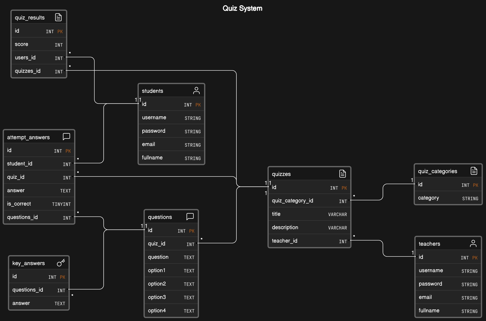

# EduQuiz API

EduQuiz is a powerful and flexible back-end software solution for efficiently managing educational quizzes. It is designed to facilitate the learning and evaluation process in educational environments, and also provides an API that can be integrated with other front-end or client applications.

## Features

### 1. Student

-   Student can register and login.
-   Student can choose quiz.
-   Student can see the question.
-   Student can do the question.
-   Student will get the result of the quiz.

### 2. Teacher

-   Teacher can register and login
-   Teacher can Create, Read, Update, Delete Quiz Categories
-   Teacher can Create, Read, Update, Delete Quizzes
-   Teacher can Create, Read, Update, Delete Question
-   Teacher can Create, Read, Update, Delete Key Answer

## Tech Stack

-   [Echo](https://echo.labstack.com/): Web Framework
-   [Gorm](https://gorm.io/): Golang ORM
-   [MySQL](https://www.mysql.com/): Relational Database
-   [Docker](https://www.docker.com/): Containerization
-   [AWS](https://aws.amazon.com/): Cloud Platform Deployment
-   [CleanArchitecture](https://github.com/Aszaychik/go-simple-clean-rest-api.git): Code Structure
-   [Git](https://git-scm.com/): Version Control
-   [JWT](https://jwt.io/): Authentication
-   [AI](https://platform.openai.com/playground): AI Recommendation

## Installation

-   Clone a Repository

```bash
git clone https://github.com/fathirarya/eduquiz-api.git
```

-   Get & Install All Dependencies

```bash
go mod tidy
```

## ERD


[View Full](https://app.eraser.io/workspace/T2GFx7zsVfxDPleyu3jJ?origin=share)
